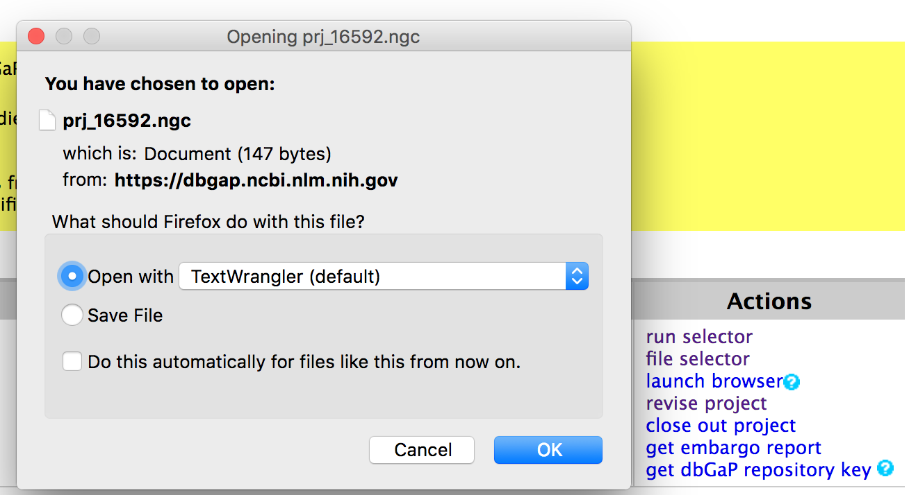

# Downloading dbGAP / 

The working directory where I did this for GTEx:

```
# working directory: /data/aryee/caleb/mitoRNA2/gtex_mito
```

This vignette is useful for working with protected-access data from 
dbGAP. In this instance, I wanted to download raw sequencing data
(`.fastq` files) from the GTEx project for further downstream analysis. 
This webpage provides an overview of some of the hiccups that I ran into trying
to make this happen. 

First, I downloaded the `dbGAP repository key`:



Next, I dragged the `.ngc` file into the working directory that I was going to download
files through. Using `vdb-config`, an executable from `SRA Toolkit`, I 


```
vdb-config --import prj_16592.ngc `pwd`
```

I ran the following loop by supplying this shell script with 
a file where each line contained an `SRR_ID` (over 9,400 total). This
will linearly download each file before running a shell script that splits, aligns, and
genotypes the mitochondria (as well as pulls down summary statistics) for each 
SRR file. 

```
#!/bin/bash

SRR_IDS=$(cat $1 |tr "\n" " ")

for SRR_ID in $SRR_IDS
do
echo $SRR_ID
prefetch --ascp-path '/apps/lab/aryee/aspera-connect-3.5.6/bin/ascp|/apps/lab/aryee/aspera-connect-3.5.6/etc/asperaweb_id_dsa.openssh' --max-size 100G --ascp-options "-T -k 2 -l 400M" $SRR_ID
bsub -q big -o /dev/null sh doOne.sh $SRR_ID
done

```

where the per-SRA worker script looked like this:

`cat doOne.sh`
```
SRR=$1

# SRA -> .fastq
fastq-dump --split-files --gzip sra/${SRR}.sra

# Align and extract mitochondria
STAR --genomeDir /data/aryee/pub/genomes/star/hg19_chr/ --readFilesIn "${SRR}_1.fastq.gz" "${SRR}_2.fastq.gz" --readFilesCommand zcat --outFileNamePrefix ${SRR}
samtools view -H "${SRR}Aligned.out.sam" > "${SRR}.sam"
awk '$3 == "chrM" {print $0}' "${SRR}Aligned.out.sam" >> "${SRR}.sam"
samtools view -Sb "${SRR}.sam" | samtools sort > "mito_bam/${SRR}.mito.bam" && samtools index "mito_bam/${SRR}.mito.bam"
samtools view  "mito_bam/${SRR}.mito.bam" | wc -l > "mito_reads/${SRR}.mitoreads.txt"
mv "${SRR}Log.final.out" "starout/${SRR}Log.final.out"

rm "sra/${SRR}.sra"
rm "${SRR}_1.fastq.gz" 
rm "${SRR}_2.fastq.gz" 
rm "${SRR}.sam"
rm "${SRR}Aligned.out.sam"
rm "${SRR}Log.progress.out"
rm "${SRR}SJ.out.tab"
rm "${SRR}Log.out"

```
<br><br>