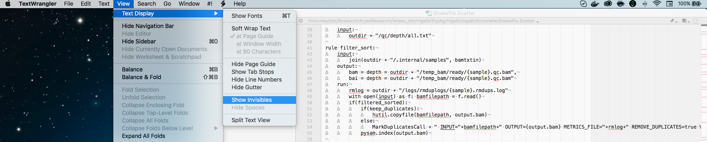

## About

[Snakemake](https://snakemake.readthedocs.io/en/stable/) is an extremely useful bioinformatics workflow 
that I've now used for a couple of my tools. The documentation is quite good, but I still produce 
several user errors or forget how to do things. This page contains some tips, tricks, and reminders
when developing tools in `Snakemake`. There are already several different straightforward guides to
getting started with `Snakemake` such as the ones [here](https://github.com/leipzig/SandwichesWithSnakemake ) and [here](http://slowkow.com/notes/snakemake-tutorial/) that are more appropriate for beginers. This page is dedicated
to higher-level concepts and frequent errors that I encounter.


## Indention problems / 'Uexpected keyword error'

An error message of this variety is something that I encounter a fair amount when developing code in `Snakemake`

```
SyntaxError in line 43 of Snakefile:
Unexpected keyword join in rule definition (Snakefile.Scatter, line 43)
```

As per [this discussion](https://groups.google.com/forum/#!topic/snakemake/9iZoH4bifOg), the issue is bad indenting in `python`,
which comes regularly for me as I often copy/paste code. As I typically develop with [TextWranger](https://www.barebones.com/products/textwrangler/), the easiest fix is to show the `invisibles` or the actual white space characters (_i.e._ the tabs and spaces), which can allow you to quickly see where you did something goofy in `python`.


<br><br>
## Skipping / bypassing / optionallying doing a step

<br><br>